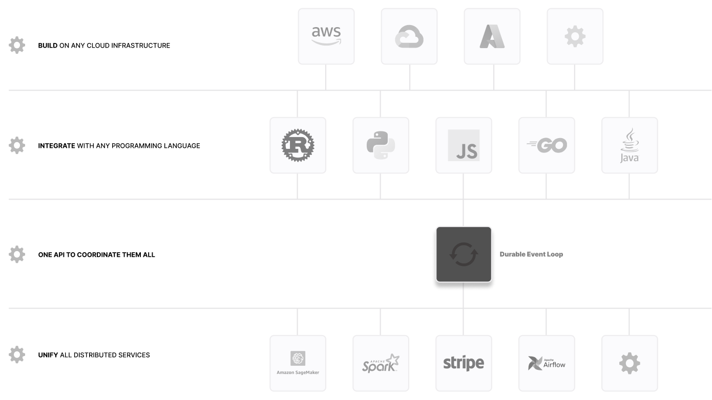

# Why Resonate?

Resonate offers a cloud computing model that allows you to build resilient applications using an intuitive programming interface centered around  **async • await**. With a familiar **async • await** interface, you can create distributed services without learning complex failure handling techniques or vendor-specific concepts. On day one, use your existing **async • await** programming knowledge to build systems that recover gracefully. 

&nbsp;

&nbsp;

### Works with your existing libraries and tools
> [ PHASE 01 INTEGRATION ]

Resonate is designed to integrate seamlessly with your tech stack. You can use your preferred language to build resilient applications on Resonate. There is no need to learn complex new tooling. Resonate meets you where you are, allowing you to leverage your existing skills to create applications that handle failures gracefully.

### One API to coordinate them all
> [ PHASE 02 UNIFICATION ] 

Resonate allows you to consolidate the bespoke cloud computing programming models you are using and simplify coordination across cloud systems by orders of magnitude. This is done through an intuitive abstraction you already know - **async • await**.

## Why should you care?

As a developer, you should care because you currently find yourself here (a.k.a drowning in complexity) 📍 

import myCurrent from '../../static/img/current.jpeg';

&nbsp;

 

&nbsp;

You care about Resonate because, unlike other cloud programming models, it simplifies distributed systems concepts through the intuitive **async • await** abstractions **you already know**. Resonate strikes a careful balance in how much complexity it hides from you. It doesn't hide so much that you lose control over the external services you need. But it also doesn't overwhelm you by exposing unnecessary technical details just for the sake of flexibility. It gives you the power and flexibility you want, through an interface designed for all computation. With Resonate, you debug only your application rather than the platform underneath it.

## Next Step

Let's go learn how to dial up the reliability of your application. 